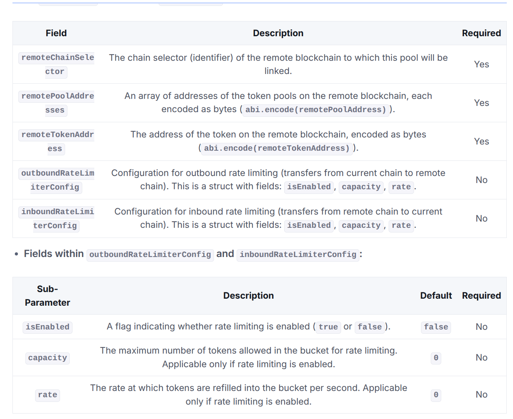

# Namaste 🙏 
# ChainLink CCIP Guide Lock/Unlock - [Official Docs](https://docs.chain.link/ccip)
[Get Chain details - Router, RMN...etc addresses here](https://docs.chain.link/ccip/directory/testnet/chain/polygon-testnet-amoy)

Before deploying on any network make sure that route is active from source to destination chain - [Check Here](https://docs.chain.link/ccip/directory/mainnet). 
In Layerzero, if a particualr network is integrated with it then we can bridge it from any other layerzero compatible network, BUT that's not the case for CCIP.

Here USBD is referred  as a ERC20 token.

**Double check the stuffs from your end before going for mainnet.**

## Deployment of ERC-20 
### **STEP-1 / Prerequisite**

- Deploy ERC-20 token

## Installation and Deployment of Token Pool 
<details>
<summary> 🔽 Installation and Deployment of Token Pool </summary>

### **STEP-2**
Ccip installation - It might take a bit more than than usual
```
npm install @chainlink/contracts-ccip@1.6.0 --force
```

### **STEP-3**
Create a new contract - `ChainlinkCcip` that will be used to deploy pool. We can override function and add any new functionality depening on our needs.Not adding anything here inorder to avoid complexity.

Inherting contract `ChainlinkCcip` is `LockReleaseTokenPool`. 

Constructor args - 
 - **IERC20 token** - address of USBD
 - **uint8 localTokenDecimals** - decimal of token 
 - **address[] memory allowlist** - Initial list of authorized addresses
 - **address rmnProxy** - address of the RMN proxy contract
 - **bool acceptLiquidity** - whether the pool accepts external liquidity
 - **address router** - address of the router contract

Deploy it on EACH network. 
<details>
<summary> 🔽 Contract </summary>

```javascript 
//SPDX-License-identifier:MIT

pragma solidity ^0.8.0;
import {LockReleaseTokenPool} from "@chainlink/contracts-ccip/contracts/pools/LockReleaseTokenPool.sol";
import {IERC20} from "@chainlink/contracts/src/v0.8/vendor/openzeppelin-solidity/v4.8.3/contracts/token/ERC20/IERC20.sol";

contract ChainlinkCcip is LockReleaseTokenPool {
    constructor(
        IERC20 token,
        uint8 localTokenDecimals,
        address[] memory allowlist,
        address rmnProxy,
        bool acceptLiquidity,
        address router
    ) LockReleaseTokenPool(token, localTokenDecimals, allowlist, rmnProxy, acceptLiquidity, router) {}
}
```
</details>

</details>


## Adding Liquidity 
<details>
<summary> 🔽 Adding Liquidity </summary>

### **STEP-4**
Update the liquidity manager (rebalancer) address on BOTH the pool.

- Contract - **ChainlinkCcip**
- Function - **setRebalancer(address rebalancer)**
- Args - **address rebalancer** -> Allows the rebalancer to add liquidity to the pool
```javascript
function setRebalancer(address rebalancer) external onlyOwner;
```
[Polygon Txn - Set Rebalancer](https://amoy.polygonscan.com/tx/0x6528ab453c6fce7aeee51487d4310c279bfe7feddc3c4b57ef430c254d22d4f0)

<details>
<summary>Command to set balancer </summary>

```javascript
cast send <CONTRACT_ADDRESS> "setRebalancer(address)" <REBALANCER_ADDRESS> \
  --rpc-url <RPC_URL> \
  --private-key <PRIVATE_KEY>

```
</details>

### **STEP-5**
- Add liquidity to each pool. Only Allows the **rebalancer** to add **liquidity** to the pool
- Requires prior token approval
- Only callable by the authorized rebalancer
- Only works if the pool accepts liquidity
----------------------------------------
- Contract - **ChainlinkCcip**
- Function - **provideLiquidity**
- Parameter- **uint256 amount** - Amount to provide liquidity. 

```javascript 
function provideLiquidity(uint256 amount) external;
```
<details>
<summary> 🔽 Foundry Script to add liquidty </summary>

```javascript 
//SPDX-L:icense-Identifier:MIT
pragma solidity 0.8.24;
import {Script, console} from "lib/forge-std/src/Script.sol";
import {Adapter} from "../../contracts/core/Adapter.sol";
import {IERC20} from "@chainlink/contracts/src/v0.8/vendor/openzeppelin-solidity/v4.8.3/contracts/token/ERC20/IERC20.sol";

contract DeployCcip is Script {
    
    address ChainlinkCcip = 0x6E7d642328668Da5fa91C0a89d582F096384032c;
    uint256 amount = 1000e18;
      function run() external {
        Adapter adpt = Adapter(ChainlinkCcip); 
        vm.startBroadcast();
        adpt.provideLiquidity(amount);
        vm.stopBroadcast();
    }
}
```
</details>

</details>


## Cross-Chain Token Standard - Registration & Administration (EVM)

Process of registering your token for Cross-Chain Token (CCT) involves a two-step process to ensure that the correct administrator is assigned. The token's administrator will initially be placed in a proposed state. The administrator must then explicitly accept the role to complete the registration.

<details>
<summary> 🔽 Registration & Administration </summary>

### **STEP-6**
Registers the admin of the token using the `owner` method.
- The caller must be the admin returned by the `owner` method of our Debt Contract.
-------------------------------------------------------------
- Contract - `RegistryModuleOwnerCustom`
- Function - `registerAdminViaOwner`
- Parameter - **address token** - Address of USBD 

[Polygon Amoy Testnet Txn ](https://amoy.polygonscan.com/tx/0x3f6132a6aec1e34ed9069f396ed44d95fea42a802ca73ced43f4175de0d1c065)

Once the administrator has been proposed and is in a pending state, they must accept the role to complete the registration process. This step finalizes the assignment of the administrator.

Make sure to do it on **BOTH** chains.
<details>
<summary> 🔽 Foundry Script to Register Owner </summary>

```javascript 
//SPDX-L:icense-Identifier:MIT
pragma solidity 0.8.24;
import {Script, console} from "lib/forge-std/src/Script.sol";
import {RegistryModuleOwnerCustom} from
    "@chainlink/contracts-ccip/contracts/tokenAdminRegistry/RegistryModuleOwnerCustom.sol";
import {IERC20} from "@chainlink/contracts/src/v0.8/vendor/openzeppelin-solidity/v4.8.3/contracts/token/ERC20/IERC20.sol";

contract CcipRegisterOwner is Script {
    /**
     * polygon
     * RegistryModuleOwnerCustom polygon 0x84ad5890A63957C960e0F19b0448A038a574936B
     * polygon - USBD(ERC20) - 0xA11AC8479D4bb89A3Cb6Ee8050bcce99ee6CFE2b
     * 
     * ARBITRUM 
     * Register Moudle - 0xE625f0b8b0Ac86946035a7729Aba124c8A64cf69
     * USBD (ERC20)- 0x9a64371655872B16395342B0C7A27C16d9eaC78e
     * 
     */
    address usbd = 0x9a64371655872B16395342B0C7A27C16d9eaC78e;
    RegistryModuleOwnerCustom register = RegistryModuleOwnerCustom(0xE625f0b8b0Ac86946035a7729Aba124c8A64cf69);
      function run() external {
        vm.startBroadcast();
        register.registerAdminViaOwner(usbd);
        vm.stopBroadcast();
    }
}
```
</details>

### **STEP-7**
Accepts the administrator role for a token.

### Who can call this function? 
Can only be called by the pending administrator

- Contract - **TokenAdminRegistry**
- Function - **acceptAdminRole(address localToken)**
- Parameter -  **address localToken** - token to accept the administrator role for

Make sure to do it on **BOTH** chains.

[Polygon Amoy Testnet Accept Admin Txn](https://amoy.polygonscan.com/tx/0x1e152cc59136b987651f54168a9cb8be570500aed11b41c737f8a262ee815318)

<details>
<summary> 🔽 Foundry Script for Accepting Admin Role </summary>

```javascript 
//SPDX-L:icense-Identifier:MIT
pragma solidity 0.8.24;
import {Script, console} from "lib/forge-std/src/Script.sol";
import {TokenAdminRegistry} from "@chainlink/contracts-ccip/contracts/tokenAdminRegistry/TokenAdminRegistry.sol";
import {IERC20} from "@chainlink/contracts/src/v0.8/vendor/openzeppelin-solidity/v4.8.3/contracts/token/ERC20/IERC20.sol";

contract CcipAcceptAdmin is Script {

    /**
     * Polygon 
     *  Token Admin registery - 0x1e73f6842d7afDD78957ac143d1f315404Dd9e5B
     *  USBD - 0xA11AC8479D4bb89A3Cb6Ee8050bcce99ee6CFE2b
     *  
     * Arbitrum 
     * Token Admin registery - 0x8126bE56454B628a88C17849B9ED99dd5a11Bd2f
     * USBD - 0x9a64371655872B16395342B0C7A27C16d9eaC78e
     * 
     */
    
    address usbd = 0x9a64371655872B16395342B0C7A27C16d9eaC78e;
    TokenAdminRegistry claimRole = TokenAdminRegistry(0x8126bE56454B628a88C17849B9ED99dd5a11Bd2f);

    function run() external {
        vm.startBroadcast();
        claimRole.acceptAdminRole(usbd);
        vm.stopBroadcast();
    }
}

```
</details>
</details>

## Linking Tokens to Pools
<details>
<summary> 🔽 Linking Tokens to Pool  </summary>

### **STEP-8**

Sets the pool for a token. Setting the pool to address(0) effectively delists the token from CCIP. Setting the pool to any other address enables the token on CCIP.

- Contract - `TokenAdminRegistry`
- Function - ```
setPool(address localToken, address pool) external onlyTokenAdmin(localToken)```
- Parameters
   - **address localToken** - USBD address to set the pool for
   - **address pool**- The pool to set for the token 

Make sure to do it on **BOTH** chains.

[Polygon Txn - Set Pool](https://amoy.polygonscan.com/tx/0x59ac14fca418b819271b0ec672ce0912c8ad3d13c98c7ce0e58dd63228d68789) 

<details>
<summary> 🔽 Foundry Script for setting pool </summary>

```javascript 
//SPDX-L:icense-Identifier:MIT
pragma solidity 0.8.24;
import {Script, console} from "lib/forge-std/src/Script.sol";
import {TokenAdminRegistry} from "@chainlink/contracts-ccip/contracts/tokenAdminRegistry/TokenAdminRegistry.sol";
import {IERC20} from "@chainlink/contracts/src/v0.8/vendor/openzeppelin-solidity/v4.8.3/contracts/token/ERC20/IERC20.sol";

contract CcipSetPool is Script {
    /**
     * Polygon 
     *  Token Admin registery - 0x1e73f6842d7afDD78957ac143d1f315404Dd9e5B
     *  USBD - 0xA11AC8479D4bb89A3Cb6Ee8050bcce99ee6CFE2b
     * Polygon pool - 0x6E7d642328668Da5fa91C0a89d582F096384032c
     *  
     * Arbitrum 
     * Token Admin registery - 0x8126bE56454B628a88C17849B9ED99dd5a11Bd2f
     * USBD - 0x9a64371655872B16395342B0C7A27C16d9eaC78e
     * Pool - 0x7f8cE0C19c0b648de19Ae7831b3c6F9DA477ffBc
     */
    address usbd = 0x9a64371655872B16395342B0C7A27C16d9eaC78e;
    address pool = 0x7f8cE0C19c0b648de19Ae7831b3c6F9DA477ffBc;
    TokenAdminRegistry poolSet = TokenAdminRegistry(0x8126bE56454B628a88C17849B9ED99dd5a11Bd2f);

    function run() external {
        vm.startBroadcast();
        poolSet.setPool(usbd,pool);
        vm.stopBroadcast();
    }
}
```

</details>
</details>

## Pool Configuration

<details>
<summary> 🔽 Setting Pool Configuration </summary>

### **STEP-9**

Initialize the token pool configuration on **EACH** blockchain to enable cross-chain transfers,

- Contract - `ChainlinkCcip` - Pool Contract 
- Function - function **applyChainUpdates**(
    uint64[] calldata remoteChainSelectorsToRemove,
    ChainUpdate[] calldata chainsToAdd
  ) external virtual onlyOwner
- Parameter - 

    - **remoteChainSelectorsToRemove** -  A list of chain selectors to remove
    - **ChainUpdate[] calldata chainsToAdd** - A list of chains and their new permission status & rate limits
          
        **ChainUpdate Struct Breakdown**
         - **uint64 remoteChainSelector** - Remote chain selector
         - **bytes[] remotePoolAddresses** - Address of the remote pool, ABI encoded in the case of a remote EVM chain
         - **bytes remoteTokenAddress** - Address of the remote token, ABI encoded in the case of a remote EVM chain.
         - **RateLimiter.Config outboundRateLimiterConfig** - Outbound rate limited config, meaning the rate limits for all of the onRamps for the given chain
         - **RateLimiter.Config inboundRateLimiterConfig** -  Inbound rate limited config, meaning the rate limits for all of the offRamps for the given chain
        ```javascript 
        struct ChainUpdate {
       uint64 remoteChainSelector;  
       bytes[] remotePoolAddresses; 
       bytes remoteTokenAddress; 
      RateLimiter.Config outboundRateLimiterConfig;  
      RateLimiter.Config inboundRateLimiterConfig; 
      }
  ```

[Polygon Testnet Txn ApplyChainUpdates](https://amoy.polygonscan.com/tx/0x10455d3184d146ecb5c5b9e8b82431e9dacbdae9909770f669bd78eca85123b2)

**Please look at this configuration again i have just used the default one for `RateLimiter.Config outboundRateLimiterConfig` and `RateLimiter.Config inboundRateLimiterConfig`** 


<details>
<summary> 🔽 Foundry Script to set remote chains </summary>

```javascript 

//SPDX-L:icense-Identifier:MIT
pragma solidity 0.8.24;
import {Script, console} from "lib/forge-std/src/Script.sol";
import {TokenPool} from "@chainlink/contracts-ccip/contracts/pools/TokenPool.sol";
import {IERC20} from "@chainlink/contracts/src/v0.8/vendor/openzeppelin-solidity/v4.8.3/contracts/token/ERC20/IERC20.sol";
import {RateLimiter} from "@chainlink/contracts-ccip/contracts/libraries/RateLimiter.sol";

contract CcipApplyChainUpdates is Script {
    /**
     * Polygon
     *  Token Admin registery - 0x1e73f6842d7afDD78957ac143d1f315404Dd9e5B
     *  USBD - 0xA11AC8479D4bb89A3Cb6Ee8050bcce99ee6CFE2b
     * Polygon pool - 0x6E7d642328668Da5fa91C0a89d582F096384032c
     *
     * Arbitrum
     * Token Admin registery - 0x8126bE56454B628a88C17849B9ED99dd5a11Bd2f
     * USBD - 0x9a64371655872B16395342B0C7A27C16d9eaC78e
     * Pool - 0x7f8cE0C19c0b648de19Ae7831b3c6F9DA477ffBc
     */

    address poolAddress = 0x7f8cE0C19c0b648de19Ae7831b3c6F9DA477ffBc;
    address remotePoolAddress = 0x6E7d642328668Da5fa91C0a89d582F096384032c;
    address remoteTokenAddress = 0xA11AC8479D4bb89A3Cb6Ee8050bcce99ee6CFE2b;

    function run() external {
        address[] memory remotePoolAddresses = new address[](1);
        remotePoolAddresses[0] = remotePoolAddress;
        /**
         * Arbitrum 3478487238524512106
         * Polygon 16281711391670634445
         */
        uint64 remoteChainSelector = 16281711391670634445;
        require(poolAddress != address(0), "Invalid pool address");
        require(remotePoolAddress != address(0), "Invalid remote pool address");
        require(remoteTokenAddress != address(0), "Invalid remote token address");
        require(remoteChainSelector != 0, "chainSelector is not defined for the remote chain");

        vm.startBroadcast();

        TokenPool poolContract = TokenPool(poolAddress);
        TokenPool.ChainUpdate[] memory chainUpdates = new TokenPool.ChainUpdate[](1);

        // Encode remote pool addresses
        bytes[] memory remotePoolAddressesEncoded = new bytes[](remotePoolAddresses.length);
        for (uint256 i = 0; i < remotePoolAddresses.length; i++) {
            remotePoolAddressesEncoded[i] = abi.encode(remotePoolAddresses[i]);
        }

        chainUpdates[0] = TokenPool.ChainUpdate({
            remoteChainSelector: remoteChainSelector, // Chain selector of the remote chain
            remotePoolAddresses: remotePoolAddressesEncoded, // Array of encoded addresses of the remote pools
            remoteTokenAddress: abi.encode(remoteTokenAddress), // Encoded address of the remote token
            outboundRateLimiterConfig: RateLimiter.Config({
                isEnabled: false, // Set to true to enable outbound rate limiting
                capacity: 0, // Max tokens allowed in the outbound rate limiter
                rate: 0 // Refill rate per second for the outbound rate limiter
            }),
            inboundRateLimiterConfig: RateLimiter.Config({
                isEnabled: false, // Set to true to enable inbound rate limiting
                capacity: 0, // Max tokens allowed in the inbound rate limiter
                rate: 0 // Refill rate per second for the inbound rate limiter
            })
        });

        // Create an empty array for chainSelectorRemovals
        uint64[] memory chainSelectorRemovals = new uint64[](0);

        // Apply the chain updates to configure the pool
        poolContract.applyChainUpdates(chainSelectorRemovals, chainUpdates);

        vm.stopBroadcast();
    }
}
```
</details>
</details>


## TRANSFER Cross chain
<details>
<summary> 🔽 Transfer token cross chain </summary>


### STEP - 10 
User will be calling `ccipSend` function on Router contract with required paramter in order to initate transfer. 

- Contract - Router
- Function - **ccipSend**(
    uint64 destinationChainSelector,
    Client.EVM2AnyMessage calldata message
  )
- Parameters 
  - **uint64 destinationChainSelector** - The destination chain ID
  - **Client.EVM2AnyMessage calldata message**
      - **bytes receiver** - abi.encode(receiver address) for dest EVM chains
      - **bytes data** - bytes data 
      - **EVMTokenAmount[] tokenAmounts** - It is a struct contains token address and amount 
      - **address feeToken** - address(0) - for native token 
      - **bytes extraArgs** -  

      **If msg.value is larger than the required fee (from getFee) we accept. The overpayment with no refund.**

[Cross chain Transfer of Token From Polygon to Arbitrum](https://ccip.chain.link/tx/0xae9153512215b4074b1e72ceb4eeee1eeccb7fddb3c977d7f83536add23d20ba#/side-drawer/msg/0x833f6901cd608c3627218af5acd219698a4eddf4b94769bbdd0438b16f7a212f)
```javascript
struct EVM2AnyMessage {
    bytes receiver; 
    bytes data;
    EVMTokenAmount[] tokenAmounts;
    address feeToken;
    bytes extraArgs;
  }
```
<details>
<summary> 🔽 Foundry Script for transferring token cross chain </summary>

```javascript 
//SPDX-L:icense-Identifier:MIT
pragma solidity 0.8.24;
import {Script, console} from "lib/forge-std/src/Script.sol";
import {TokenAdminRegistry} from "@chainlink/contracts-ccip/contracts/tokenAdminRegistry/TokenAdminRegistry.sol";
import {IERC20} from "@chainlink/contracts/src/v0.8/vendor/openzeppelin-solidity/v4.8.3/contracts/token/ERC20/IERC20.sol";
import {IRouterClient} from "@chainlink/contracts-ccip/contracts/interfaces/IRouterClient.sol";
import {Client} from "@chainlink/contracts-ccip/contracts/libraries/Client.sol";

contract CcipTransferToken is Script {
    /**
     * Polygon
     *  Token Admin registery - 0x1e73f6842d7afDD78957ac143d1f315404Dd9e5B
     *  USBD - 0xA11AC8479D4bb89A3Cb6Ee8050bcce99ee6CFE2b
     * Router - 0x9C32fCB86BF0f4a1A8921a9Fe46de3198bb884B2
     * Chain selector - 16281711391670634445
     * Chain id - 80002
     *
     *
     * Arbitrum
     * Token Admin registery - 0x8126bE56454B628a88C17849B9ED99dd5a11Bd2f
     * USBD - 0x9a64371655872B16395342B0C7A27C16d9eaC78e
     * Chain selector - 3478487238524512106
     * Router - 0x2a9C5afB0d0e4BAb2BCdaE109EC4b0c4Be15a165
     * chain id - 421614
     */

    address router = 0x2a9C5afB0d0e4BAb2BCdaE109EC4b0c4Be15a165;
    uint64 destinationChainSelector = 16281711391670634445;
    address tokenAddress = 0x9a64371655872B16395342B0C7A27C16d9eaC78e;
    uint256 amount = 10e18;
    uint256 destinationChainId = 80002;
    address feeTokenAddress = address(0); // pay  fee in native token

    function run() external {
        vm.startBroadcast();
        IRouterClient routerContract = IRouterClient(router);

        // Check if the destination chain is supported by the router
        require(tokenAddress != address(0), "Invalid token address");
        require(amount > 0, "Invalid amount to transfer");
        require(routerContract.isChainSupported(destinationChainSelector), "Destination chain not supported");

       // ================================================================
       // │                   Prepare the CCIP message                    │
       // ================================================================
    
        Client.EVM2AnyMessage memory message = Client.EVM2AnyMessage({
            receiver: abi.encode(msg.sender), // Receiver address on the destination chain
            data: abi.encode(), // No additional data
            tokenAmounts: new Client.EVMTokenAmount[](1), // Array of tokens to transfer
            feeToken: feeTokenAddress, // Fee token (native or LINK)
            extraArgs: abi.encodePacked(
                bytes4(keccak256("CCIP EVMExtraArgsV1")), // Extra arguments for CCIP (versioned)
                abi.encode(uint256(0)) // Placeholder for future use
            )
        });

    // ================================================================
    // │                Set the token and amount to transfer           │
    // ================================================================
 
        message.tokenAmounts[0] = Client.EVMTokenAmount({token: tokenAddress, amount: amount});

       // ================================================================
       // │ Approve the router to transfer tokens on behalf of the sender │
       // ================================================================       

        IERC20(tokenAddress).approve(router, amount);

       // ================================================================
       // │        Estimate the fees required for the transfer           │
       // ================================================================

        uint256 fees = routerContract.getFee(destinationChainSelector, message);

       // ================================================================
       // │                              SEND                             │
       // ================================================================
        bytes32 messageId = routerContract.ccipSend{value: fees}(destinationChainSelector, message);

        // Log the Message ID
        console.log("Message ID:");
        console.logBytes32(messageId);
        vm.stopBroadcast();
    }
}
```

</details>
</details>

### Hurray!!!! you have successfully transferred your token cross-chain by using chainlink CCIP
# धन्यवाद 🙏 